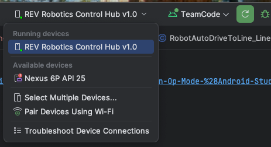

# WestG WolverMachines Team Code

## Setup 

### Configuring Androud Studio
This is explained in the (FTC Documentation)[https://ftc-docs.firstinspires.org/en/latest/programming_resources/tutorial_specific/android_studio/installing_android_studio/Installing-Android-Studio.html#configuring-android-studio-ladybug-and-later] 
but summarized below:

- I believe we all have Android Studio Installed, but the default version of the Java Development Kit (JDK) is not compatible with the Robot Controller project
- Install JDK 17 via Installer found on https://www.oracle.com/java/technologies/javase/jdk17-archive-downloads.html.
  - Ask if you need help deciding what version you need for you laptop-
- The you need to configure Android Studio to use this new version.
  - Settings -> Build, Execution, Deployment -> Build Tools -> Gradle
  - In the "Gradle JDK" drop down menu,  select the one that says "17 Oracle OpenJDK"

### Configuring Hardware

When Referencing hardware from the code, we need to make sure the Control Hub is configured for 
such hardware.

i.e. For the **(TEST: Initial Linear OpMode)[./src/main/java/org/firstinspires/ftc/teamcode/BasicOpMode_Linear.java]** 
in our code, we use two drives, left and right. In the code, we have:

```java
leftDrive  = hardwareMap.get(DcMotor.class, "left_drive");
rightDrive = hardwareMap.get(DcMotor.class, "right_drive");
```

So we need to configure the Control Hub to define what `left_drive` and what `right_drive` is.  When
configuring them, we are basically seting up variables that reference the pin outputs on the control
hub.  Then in the code above, we get "references" to the hardware components, which we can then
act upon, by the objects resturned form `hardwareMap.get(...)`. So in this example, `leftDrive` is 
a local variable, that points to the drive itself.

We can configure the Control Hub though the OnBot configuration ((connect your computer to the 
Control hub WIFI network)[https://docs.revrobotics.com/duo-control/control-hub-gs/connect-to-the-control-hub-robot-control-console#web-browser]),
or by configuring it on the (Driver Hub itself).[https://ftc-docs.firstinspires.org/en/latest/hardware_and_software_configuration/configuring/index.html].

I have found doing it on the Driver Hub itself is simple enough. Follow the instructions on the
(Creating a Configuration File Using the DRIVER STATION)[https://ftc-docs.firstinspires.org/en/latest/hardware_and_software_configuration/configuring/getting_started/getting-started.html#creating-a-configuration-file-using-the-driver-station] 
page.

## Programming OpModes

The (external_samples)[../FtcRobotController/src/main/java/org/firstinspires/ftc/robotcontroller/external/samples] 
folder has all kinds of sammples that you can copy / paste into our Control TeamCode Folder. All
our custom control hub code will go there.

(This tutorial)[https://ftc-docs.firstinspires.org/en/latest/programming_resources/tutorial_specific/android_studio/creating_op_modes/Creating-and-Running-an-Op-Mode-%28Android-Studio%29.html#sample-op-modes] explains 
w to copy the samples and place them in the TeamCode folder.

For our first test, the file (BasicOpMode_Linear.java)[.//src/main/java/org/firstinspires/ftc/teamcode/]
was copied and only a small change was made in the file:

```java
// Original Code
@TeleOp(name="Basic: Linear OpMode", group="Linear OpMode")
@Disabled

// Modified Code (renamed it, and removed "@Disabled"
@TeleOp(name="TEST: Initial Linear OpMode", group="Linear OpMode")
```

## Installing to the Control Hub
Once our code is ready in the **TeamCode** folder, we can deploy it to the Control Hub. The 
instructions (Building and Installing Your Op Mode)[https://ftc-docs.firstinspires.org/en/latest/programming_resources/tutorial_specific/android_studio/creating_op_modes/Creating-and-Running-an-Op-Mode-%28Android-Studio%29.html#building-and-installing-your-op-mode] 
detail how to perform this.  In short:

1. Connect the control hub to your computer via USB (USB-C on the Control Hub must be used). 
  - USB-C to USB-C if you computer had USB-C
  - USB-C to USB-A (normal larger rectangle connector)
2. Make sure the Control Hub shows up in the top title bar of Android Studio.
  
3. Once available, Click the `Run TeamCode` Green button in the title bar.

## Running

Our Driver Station was already configured to connect to the Control Hub WIFI network. Assuming you
have deployed the Application to the Control hub, it is now time to run the application. See
(Running Your Op Mode)[https://ftc-docs.firstinspires.org/en/latest/programming_resources/tutorial_specific/android_studio/creating_op_modes/Creating-and-Running-an-Op-Mode-%28Android-Studio%29.html#running-your-op-mode] 
but basically:

1. Make sure you have the configuration applies (see above [#configuring-hardware])
2. Click the "Select OpMode" down arrow.
3. Choose your OpMode
4. You will now see it, click **INIT**.
